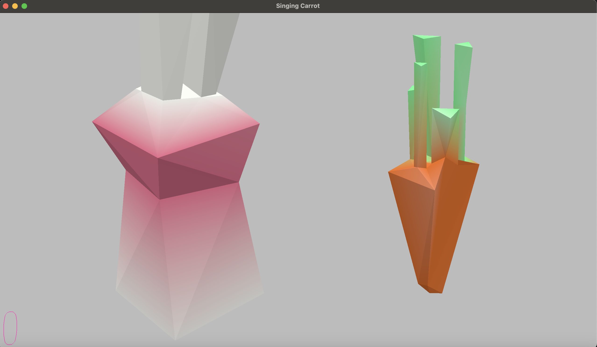

# Singing Carrot

Author: Charvi Hoysal (choysal)

Design: The carrot will sing 4 notes: the bunny has to hit the right notes to immitate him in the right order! Try to get as high of a score as possible!

Credits: 
Music and all sounds authored by me using beepbox.co

Screen Shot:

How To Play:

Hit WASD to play the correct notes!
Copy the carrot's random four note sequence in the correct order. you will get audio feedback as to if you did something wrong, and your score will go up if you got it correct!
Hit space if you need to hear the carrot sing the current sequence again.
Note: getting a note wrong or pressing space will reset the note sequence you are playing: so make sure to start over!

There's a score coutner in the bottom left corner. try to get as many points as possible!

This game was built with [NEST](NEST.md).
